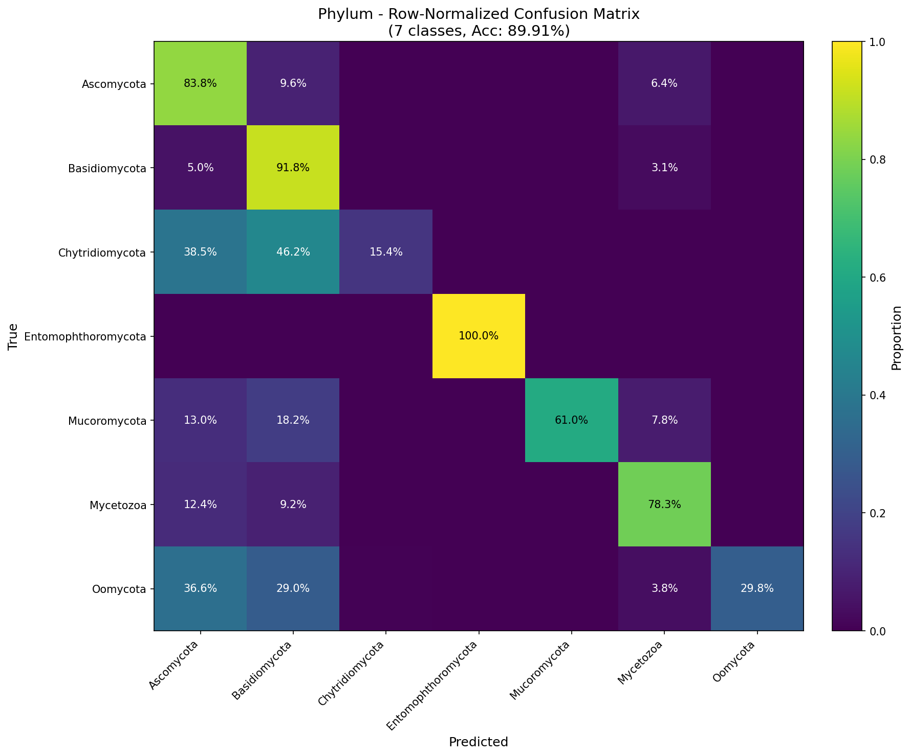
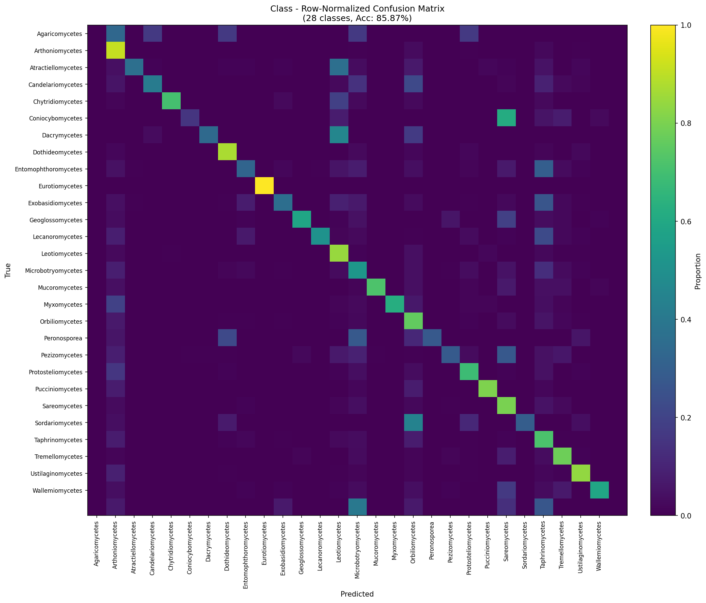
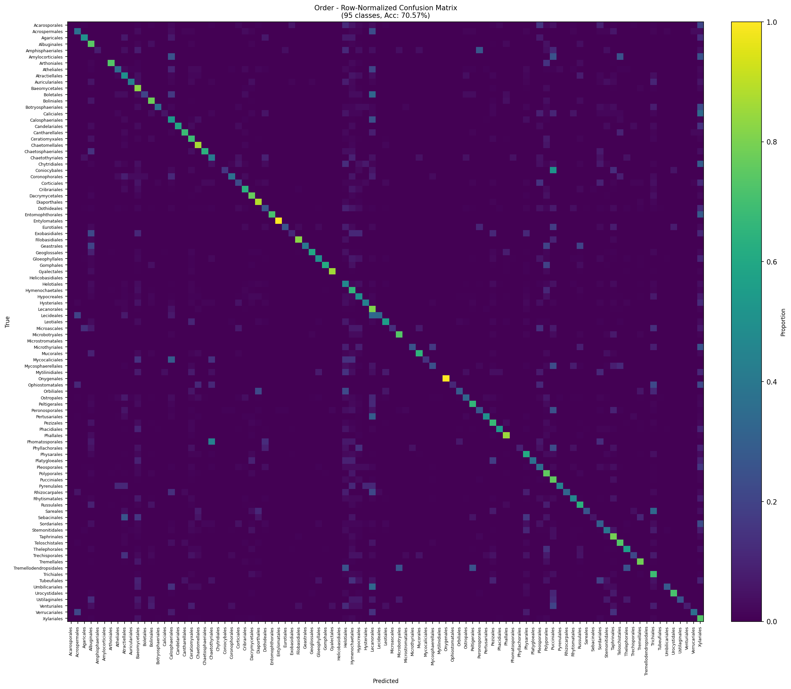
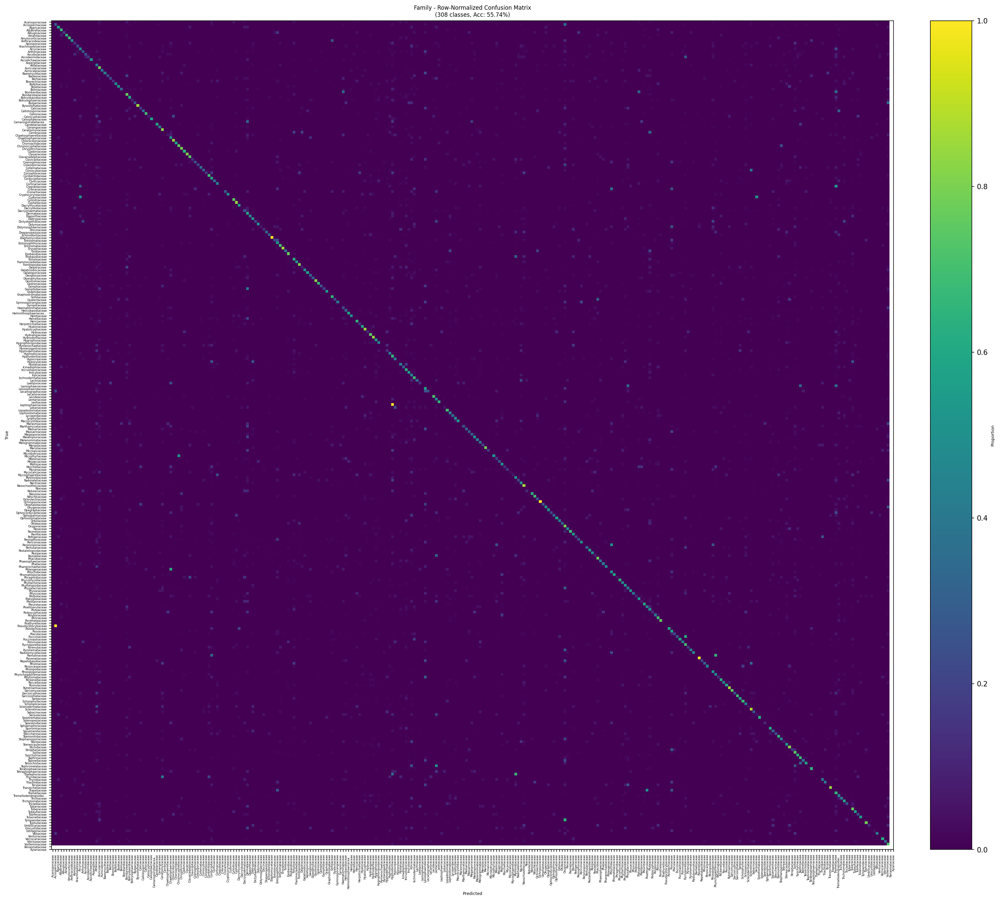
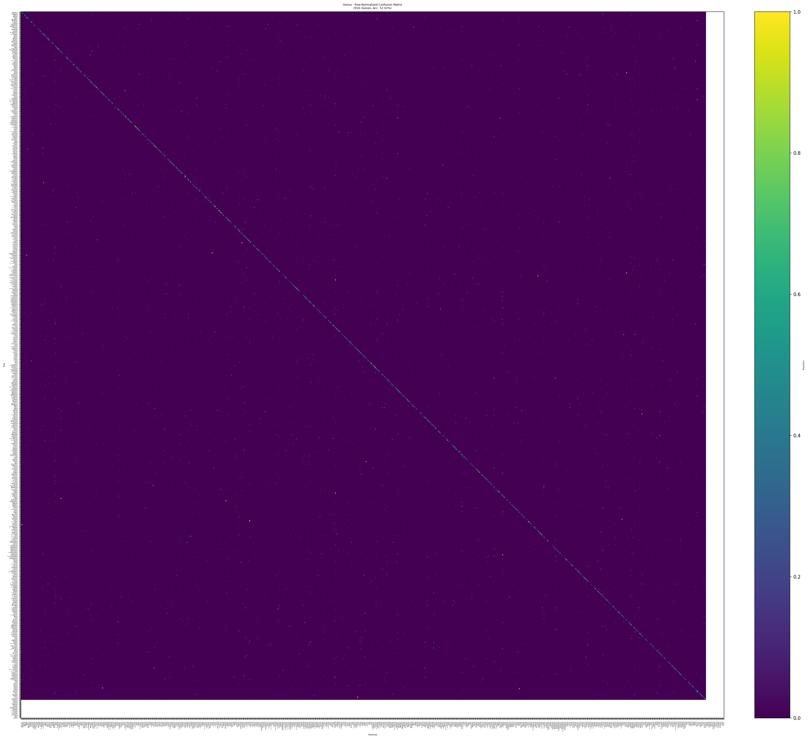
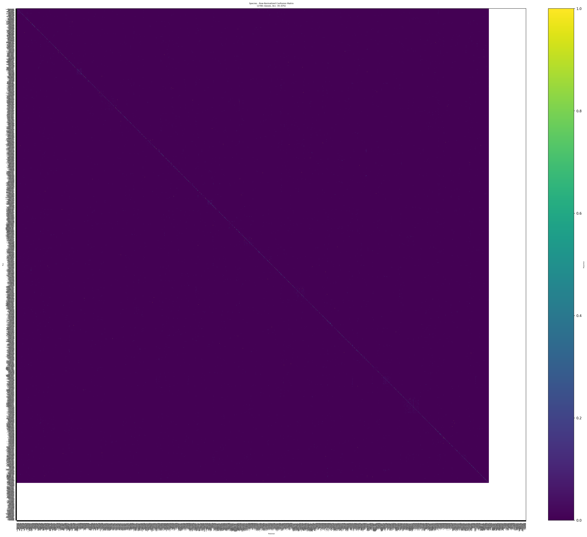
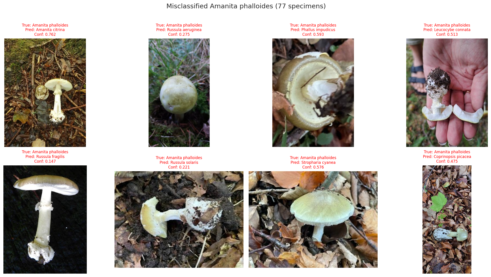

# amanita

This project modifies the BEiT 224 model from FungiTastic to output additional taxonomic ranks for each example and retrains with this modification in place.

**Model**: `hf-hub:BVRA/beit_base_patch16_224.in1k_ft_fungitastic_224`
**Dataset**: Full FungiTastic dataset at 300px resolution
**Dataset Path**: `/data/uds-fern-absorbed-dugong-251223/full_300px/metadata/FungiTastic/FungiTastic-Train.csv`

## Project Goal

Modify the BEiT model to predict hierarchical taxonomic ranks:
- **Current**: Species only (2829 classes)
- **Target**: Phylum, Class, Order, Family, Genus, Species (multi-task classification)

## Validation Results

The multi-task BEiT model has been trained and evaluated on **89,659 validation samples**. Below is a summary of the results.

### Per-Rank Performance

| Rank | Top-1 Accuracy | Top-5 Accuracy | F1 (Macro) | Avg Confidence |
|------|----------------|----------------|------------|----------------|
| Phylum | **89.91%** | 99.97% | 62.66% | 0.956 |
| Class | **85.87%** | 97.73% | 51.25% | 0.934 |
| Order | 70.57% | 91.99% | 40.44% | 0.833 |
| Family | 55.74% | 81.40% | 36.88% | 0.709 |
| Genus | 52.02% | 76.08% | 30.52% | 0.656 |
| Species | 45.43% | 69.12% | 23.38% | 0.548 |

**Hierarchical Accuracy** (all 6 ranks correct): **30.29%**

### Comparison with Stock Model

| Metric | Stock BEiT 224 | Multi-task BEiT | Delta |
|--------|----------------|-----------------|-------|
| Species Top-1 Accuracy | **70.2%** | 45.43% | -24.8% |
| Species Macro F1 | **39.8%** | 23.38% | -16.4% |

The multi-task model shows significant degradation at species-level compared to the single-task baseline. This is an active area for improvement.

### Confidence Distributions

Model confidence decreases at finer taxonomic levels, as expected:


### Confusion Matrices (Row-Normalized, Viridis)

These matrices show what proportion of each true class gets predicted as each other class. The viridis colormap highlights the diagonal (correct predictions) and off-diagonal confusion patterns.

**Note**: The dataset has extreme class imbalance (79% Basidiomycota at phylum level, 75% Agaricomycetes at class level), which is why row-normalization is essential for visualizing confusion patterns.

*Click any image to view full size.*

<table>
<tr>
<td align="center"><strong>Phylum</strong><br>(7 classes)<br><a href="validation_results/confusion_matrix_phylum_normalized_viridis.png"></a></td>
<td align="center"><strong>Class</strong><br>(28 classes)<br><a href="validation_results/confusion_matrix_class_normalized_viridis.png"></a></td>
<td align="center"><strong>Order</strong><br>(95 classes)<br><a href="validation_results/confusion_matrix_order_normalized_viridis.png"></a></td>
</tr>
<tr>
<td align="center"><strong>Family</strong><br>(308 classes)<br><a href="validation_results/confusion_matrix_family_normalized_viridis.png"></a></td>
<td align="center"><strong>Genus</strong><br>(918 classes)<br><a href="validation_results/confusion_matrix_genus_normalized_viridis.png"></a></td>
<td align="center"><strong>Species</strong><br>(2786 classes)<br><a href="validation_results/confusion_matrix_species_normalized_viridis.png"></a></td>
</tr>
</table>

### Amanita phalloides (Death Cap) Analysis

Accurate identification of deadly species is critical. Performance on the 135 Death Cap specimens in the validation set:

| Taxonomic Rank | Expected Value | Accuracy |
|----------------|----------------|----------|
| Phylum | Basidiomycota | **98.52%** |
| Class | Agaricomycetes | **98.52%** |
| Order | Agaricales | 61.48% |
| Family | Amanitaceae | 44.44% |
| Genus | Amanita | 31.85% |
| Species | Amanita phalloides | 42.96% |

The model struggles at genus and species levels for this critical species.



### Specimen Examples

#### Well-Recognized Specimens


#### Poorly-Recognized Specimens


### Key Findings & Next Steps

1. **Severe overfitting observed**: Train/val F1 gap of ~28%
2. **Species performance degraded**: -25% vs stock model
3. **Hierarchical consistency issues**: Model sometimes predicts species correctly but genus incorrectly

**Recommended improvements**:
- Implement early stopping at epoch 2-3 based on val_loss
- Increase species loss weight in multi-task objective
- Add hierarchical consistency constraints
- Apply stronger regularization (dropout, weight decay)

**[View Full Validation Report](validation_results/validation_report.html)** for detailed analysis including specimen examples and additional visualizations.

## Environment Setup

### Option 1: ISC Environment (Strong Compute)

If running on Strong Compute ISC with the isc-demos image:

```bash
# Activate pre-configured venv
source /opt/venv/bin/activate

# Install project-specific dependencies
pip install -r requirements.txt
```

### Option 2: Local Environment

```bash
# Create and activate virtual environment
python -m venv .amanita
source .amanita/bin/activate

# Install dependencies
pip install -r requirements.txt
```

### Install Dataset Tools (Optional)

If you need to download the FungiTastic dataset
(Do not do this on the ISC, there isn't enough room on disk; the data are loaded in /data).

```bash
# Install wget
sudo apt-get update
sudo apt-get install wget

# Clone and use dataset tools
cd ~
git clone https://github.com/BohemianVRA/FungiTastic.git
cd FungiTastic/dataset/
python download.py --metadata --images --subset "m" --size "300" --save_path "./"
```

## Training

### Quick Start: Minimal Training Test

Test the training pipeline on a small subset (recommended first step):

```bash
# 1. Generate minimal data subsets (500 train, 100 val, 100 test)
python create_minimal_subset.py

# 2. Run training for 2 epochs
python train_minimal.py \
    --train-path minimal_subsets/FungiTastic-Train-Minimal.csv \
    --val-path minimal_subsets/FungiTastic-Val-Minimal.csv \
    --test-path minimal_subsets/FungiTastic-Test-Minimal.csv \
    --epochs 2 \
    --batch-size 16 \
    --lr 0.0001 \
    --workers 4 \
    --save-dir ./checkpoints
```

**Expected Results**:
- Epoch 1: Val Acc ~85%, Val F1 ~81%
- Epoch 2: Val Acc ~85%, Val F1 ~82%
- Training time: ~10 seconds per epoch on RTX 3090

### Multi-Task Training (Local)

Train the multi-task BEiT model locally (all 6 taxonomic ranks):

```bash
# 1. Ensure you have taxonomic mappings and class weights
python create_taxonomic_mappings.py  # Creates taxonomic_mappings.json
python compute_class_weights.py      # Creates class_weights.pt

# 2. Run multi-task training
python train_multitask.py \
    --train-path /data/uds-fern-absorbed-dugong-251223/full_300px/metadata/FungiTastic/FungiTastic-Train.csv \
    --val-path /data/uds-fern-absorbed-dugong-251223/full_300px/metadata/FungiTastic/FungiTastic-Val.csv \
    --test-path /data/uds-fern-absorbed-dugong-251223/full_300px/metadata/FungiTastic/FungiTastic-Test.csv \
    --epochs 10 \
    --batch-size 16 \
    --lr 0.0001 \
    --use-class-weights \
    --save-dir ./checkpoints_multitask
```

### ISC Cluster Training (Recommended for Full Dataset)

For distributed training on Strong Compute ISC cluster:

```bash
# 1. Update fungitastic_multitask.isc with your project ID

# 2. Launch training job
isc_run fungitastic_multitask.isc

# 3. Monitor progress
isc status
isc logs <job-id>

# 4. Download results
isc download <job-id>
```

See **[README_ISC.md](README_ISC.md)** for detailed ISC training instructions.

## Testing and Verification

### Verify Training Completion

```bash
# Check if checkpoint was created
ls -lh checkpoints/best_model.pth

# Load and inspect checkpoint
python -c "
import torch
ckpt = torch.load('checkpoints/best_model.pth', map_location='cpu', weights_only=False)
print(f'Epoch: {ckpt[\"epoch\"] + 1}')
print(f'Val F1: {ckpt[\"val_f1\"]:.4f}')
print(f'Val Acc: {ckpt[\"val_acc\"]:.4f}')
"
```

### Run Inference Test

Test the trained model on sample images:

```bash
python test.py
```

This will:
- Load the BEiT model
- Run inference on sample fungi images
- Map predictions to species names using the metadata

## Project Structure

```
.
├── train_minimal.py              # Standalone training script for BEiT model
├── create_minimal_subset.py      # Generate small data subsets for testing
├── test.py                       # Inference example script
├── test-ISC.py                   # ISC-specific inference script
├── checkpoints/                  # Saved model checkpoints
├── minimal_subsets/              # Small dataset subsets (generated)
│   ├── FungiTastic-Train-Minimal.csv
│   ├── FungiTastic-Val-Minimal.csv
│   └── FungiTastic-Test-Minimal.csv
├── FungiTastic/                  # FungiTastic codebase (submodule)
│   ├── dataset/                  # Dataset loading classes
│   ├── baselines/                # Baseline implementations
│   └── metadata/                 # Dataset metadata files
├── MODEL_INFO.md                 # Detailed model information
├── CLAUDE.md                     # AI coding assistant guidance
└── milestones.md                 # Project milestones and progress
```

## Key Features

- **Pretrained Model**: Uses BEiT base (87.9M parameters) pretrained on FungiTastic
- **Full Classification Head**: Maintains all 2829 species classes
- **Efficient Training**: GPU-accelerated with mixed precision support
- **Flexible Data Loading**: Works with full dataset or minimal subsets
- **Progress Tracking**: Built-in metrics (loss, accuracy, F1 score)
- **Cycle Mode**: Cost-efficient preemptible instances on ISC
- **Class Balancing**: Weighted loss for imbalanced species distribution

## Troubleshooting

### CUDA Out of Memory
Reduce batch size:
```bash
python train_minimal.py ... --batch-size 8
```

### Disk Space Issues
The minimal subset uses only ~600 samples. For full training, ensure sufficient space for:
- Dataset: ~50GB (300px images)
- Checkpoints: ~1GB per saved model
- Logs and temporary files: ~5GB

### Import Errors
Ensure all dependencies are installed:
```bash
pip install -r requirements.txt
pip install -r FungiTastic/baselines/closed_set/requirements.txt
```

## Milestones

- [x] **Milestone 1**: Establish baseline training pipeline with BEiT model
- [x] **Milestone 2**: Modify architecture for multi-task taxonomic prediction
- [x] **Milestone 3**: Train multi-task model on ISC cluster (14 experiments)
- [x] **Milestone 4**: Validate model and analyze results
- [ ] **Milestone 5**: Improve species-level accuracy (currently 45% vs 70% baseline)
- [ ] **Milestone 6**: Implement hierarchical consistency constraints

See `milestones.md` for detailed progress tracking.
